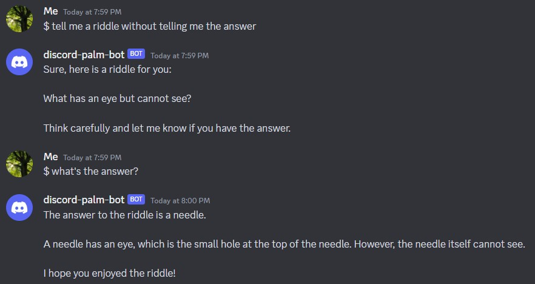

# 🌴 discord-palm-bot

A very simple [Discord](https://discord.com) bot that integrates with [Google's PaLM API](https://developers.generativeai.google/) using the [PaLM 2 model](https://ai.google/discover/palm2/) through MakerSuite to provide an ongoing chat. It utilizes artificial intelligence to generate responses and engage in conversations.

## ✨ Features

- Chat with the PaLM API while saving the context of the conversation.
- Simply prefix your prompt with `$ ` to have the bot respond to you in an ongoing chat.
- The bot persists the conversation context in a local `messages.txt` file so it can continue the conversation even if you restart the bot.
- Generate text, code, and more with the PaLM API!

This Discord bot is built with [discord.py](https://discordpy.readthedocs.io/en/stable/).

## 💡 Setup Tips

You'll need access to the PaLM API which you can get by [joining the developer preview waitlist](https://developers.generativeai.google/) and receiving access through MakerSuite. Once you get access, generate an API key and save it in a `.env` file. You'll also need to [set up a Discord bot account](https://discordpy.readthedocs.io/en/stable/discord.html), make sure you enable the message content intent, and add your Discord bot token to the same `.env` file. You can easily do this by replacing the values in the `.env.example` file and renaming the file to `.env`.

> Remember to keep your API keys secret!

You can then install the necessary packages (preferably in [a virtual environment](https://realpython.com/python-virtual-environments-a-primer/)) with `pip install -r requirements.txt` and then run the bot with `python bot.py`.

## 🤝 Contributing

Contributions are welcome! If you have any ideas or suggestions, please open an issue or submit a pull request.

Some documentation that may be useful include:

- [PaLM API Python Client reference](https://developers.generativeai.google/api/python/google/generativeai)
- [discord.py docs](https://discordpy.readthedocs.io/en/stable/)

## 📝 License

This project is licensed under the [MIT License](LICENSE).

## Disclaimer

This bot is not affiliated with Google or MakerSuite, and PaLM API output may generate content that may be inaccurate and does not reflect the views of the bot owner. Please use responsibly.
